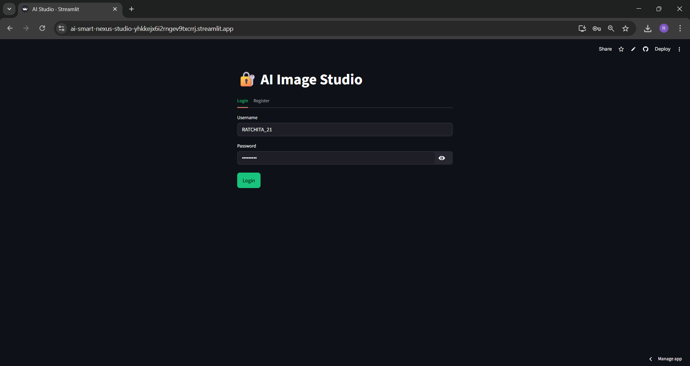
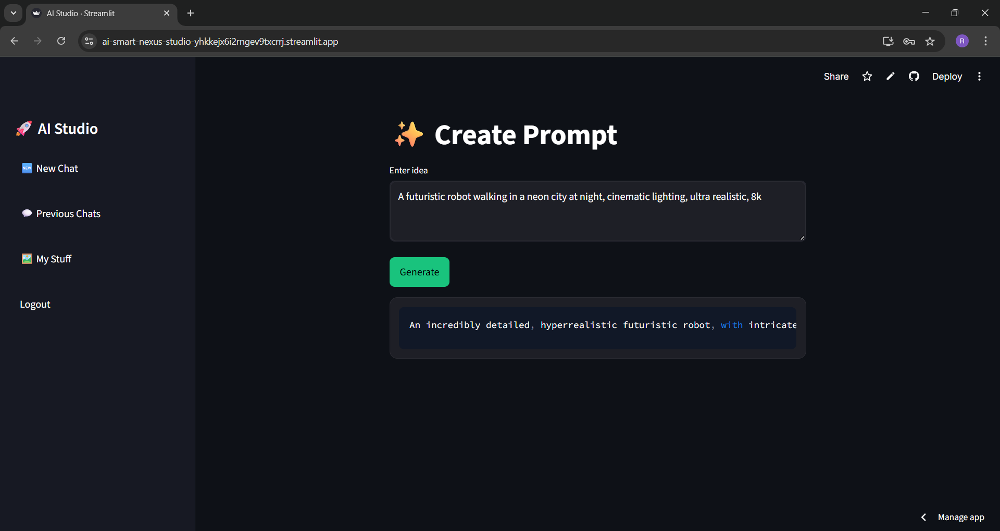
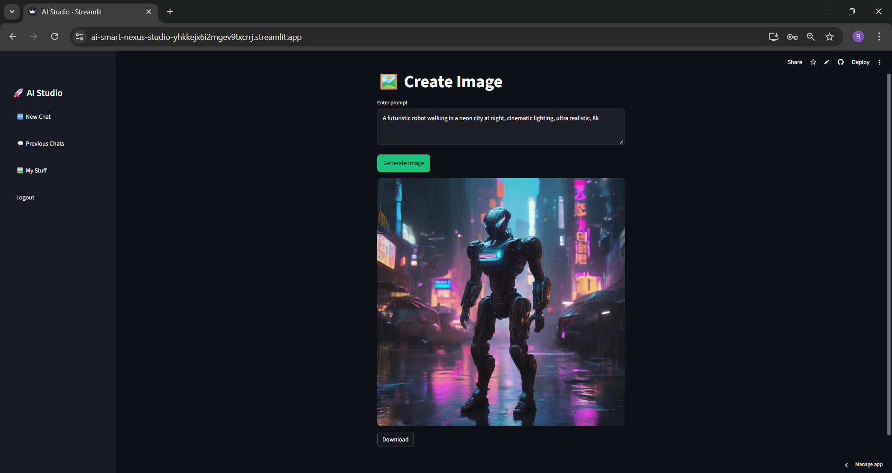
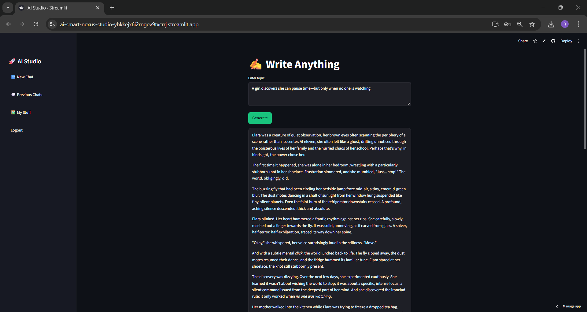
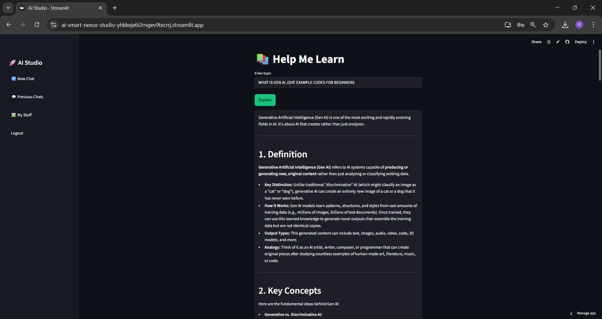
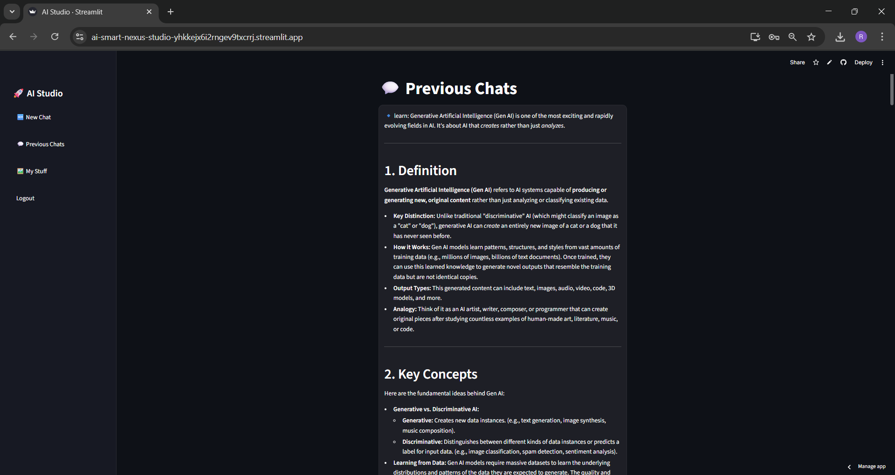
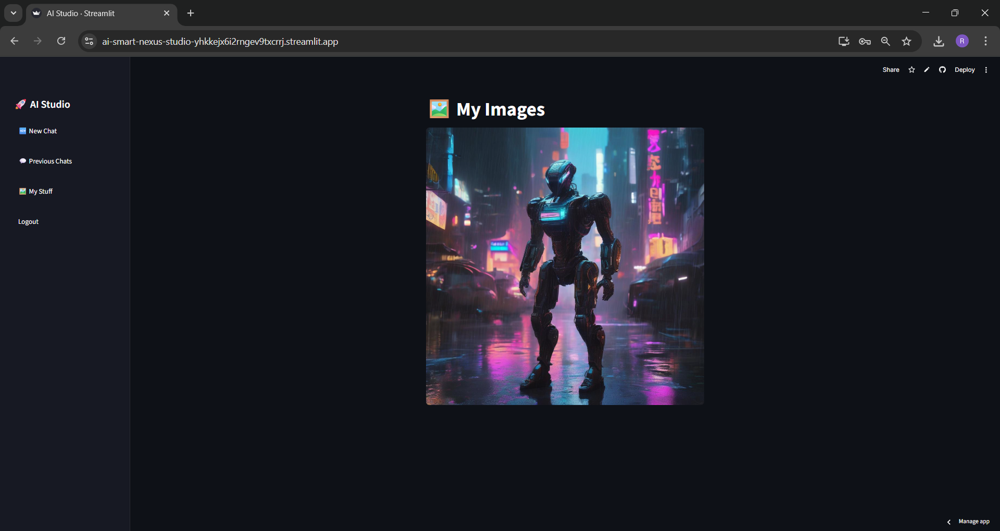

---

# 🚀 AI Smart Nexus Studio

> 🧠 A complete **AI-powered multi-tool platform** built with Streamlit, integrating **Generative AI, Prompt Engineering, Image Generation, and Smart Learning Assistant** — all in one place.

🔗 **Live Demo:**
https://ai-smart-nexus-studio-yhkkejx6i2rngev9txcrrj.streamlit.app/

---

## ✨ Overview

**AI Smart Nexus Studio** is a modern AI application that allows users to:

* Generate high-quality prompts
* Create AI images
* Write stories and content
* Learn concepts with structured explanations
* Store chats and generated assets

👉 Designed with a **clean UI + modular architecture + real-world AI integration**

---

## ⚡ Features

### 🔐 Authentication System

* Login / Register system
* Persistent user storage (JSON-based)
* Session management with Streamlit

---

### ✨ Prompt Engineering Engine

* Converts simple ideas → **advanced prompts**
* Uses AI to enhance creativity & detail

---

### 🖼️ Image Generation

* Generate images from text prompts
* Supports **high-quality AI outputs**
* Download generated images
* Stores images in personal gallery

---

### ✍️ Write Anything

* Generate:

  * Stories
  * Articles
  * Ideas
* Uses advanced generative AI responses

---

### 📚 Help Me Learn

* Structured AI explanations:

  * Definitions
  * Concepts
  * Examples
* Beginner-friendly + detailed learning

---

### 💬 Chat System

* Stores previous chats
* Organized user history
* Persistent data using JSON

---

### 🖼️ My Gallery

* View generated images
* Personal asset storage
* Clean UI display

---

## 🧠 Tech Stack

### 🚀 Core Technologies

* **Python 3.10**
* **Streamlit** (UI + App Framework)

---

### 🤖 AI & APIs

* **Google Gemini API (gemini-2.5-flash)**
* **Hugging Face API**
* **Generative AI Models**

---

### 🧩 Backend Modules

* Authentication system (`auth.py`)
* Chat storage (`chat_store.py`)
* Prompt engineering (`prompt_engineering.py`)
* Image generation (`image_generator.py`)
* Image storage (`image_store.py`)
* Gemini integration (`gemini_prompt.py`)

---

### 📦 Libraries Used

* `streamlit`
* `google-generativeai`
* `python-dotenv`
* `Pillow`
* `json`
* `os`

---

### 💾 Data Storage

* JSON-based local database:

  * `users.json`
  * `chats.json`

---

## 📂 Project Structure

```bash
AI-SMART-NEXUS-STUDIO/
│
├── assets/screenshots                 
├── data/
│   ├── users.json
│   └── chats.json
│
├── modules/
│   ├── auth.py
│   ├── chat_store.py
│   ├── gemini_prompt.py
│   ├── image_generator.py
│   ├── image_store.py
│   └── prompt_engineering.py
│
├── app.py                  
├── config.py
├── requirements.txt
├── .env
├── README.md
└── LICENSE
```

---

## 📸 Screenshots

### 🏠 Home UI



### ✨ Create Prompt



### 🖼️ Create Image



### ✍️ Write Anything



### 📚 Help Me Learn



### 💬 Previous Chats



### 🖼️ My Gallery



---

## ⚙️ Installation

```bash
git clone https://github.com/22AD040/ai-smart-nexus-studio.git
cd ai-nexus-image-gen
pip install -r requirements.txt
```

---

## 🔑 Environment Variables

Create a `.env` file:

```env
GEMINI_API_KEY=your_gemini_api_key
HF_API_KEY=your_huggingface_api_key
```

---

## ▶️ Run Locally

```bash
streamlit run app.py
```

---

## 🚀 Deployment

* Deployed using **Streamlit Cloud**
* Secure API keys using **Secrets Manager**

---

## 🎯 Key Highlights

✔ Clean UI (Dark Theme)
✔ Modular scalable architecture
✔ Real-world AI integration
✔ Multi-feature AI platform
✔ Beginner-friendly + production-ready

---

## 🔮 Future Enhancements

* 🎤 Voice input & AI assistant
* 🧠 Multi-model switching (OpenAI, Claude, etc.)
* ☁️ Cloud database (Firebase / MongoDB)
* 📱 Mobile responsive UI
* 🧩 Plugin-based architecture

---

## 👩‍💻 Author

**Ratchita B**
🚀 GEN AI & Machine Learning Enthusiast

---

## ⭐ Support

If you like this project:

👉 Give it a ⭐ on GitHub
👉 Share with others

---

## 📜 License

This project is licensed under the **MIT License**.
